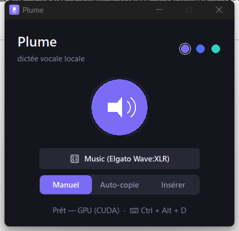

# Plume

Local, offline speech-to-text for Windows. Plume captures audio from your microphone
and/or from what the PC is playing (system loopback), transcribes it on-device with an
OpenAI Whisper model, and returns punctuated **French** text — ready to copy or to type
directly into the active window.


-76B900?logo=nvidia&logoColor=white)
<!-- TODO: add a license badge once a LICENSE file is chosen, e.g.  -->

> Everything runs locally. After the Whisper model is downloaded once, the application
> works fully offline and no audio ever leaves the machine.

## Overview

Plume is a small desktop tool built around a single Tkinter window: pick one or more
audio sources, press record, and the transcribed text appears in a panel. It is tuned
for French dictation and preserves the punctuation Whisper infers from intonation and
pauses. It runs on the GPU when an NVIDIA card is available and falls back to the CPU
automatically otherwise.



<!-- TODO: optional — add a screenshot of the audio source selector as docs/screenshot-sources.png -->

## Features

- **Fully local & offline transcription** — audio is processed on-device; no cloud, no account.
- **Microphone and/or system-audio capture** via WASAPI loopback, with multiple sources mixed together (e.g. your mic plus a call).
- **GPU-accelerated** inference (NVIDIA CUDA, `float16`) with **automatic CPU fallback** (`int8`).
- **Punctuated French output** with light post-processing and user-defined word corrections (`plume_replacements.json`).
- **Live transcription (optional)** — instead of waiting for you to press stop, the text is transcribed and refined *as you speak*. Only a bounded, recent window is re-processed on each pass, so CPU/GPU load stays roughly linear and long dictations remain responsive.
- **Flexible output**: manual copy, clipboard auto-copy, or direct keystroke insertion into the active window, paired with a **global hotkey** (`Ctrl + Alt + D`). In insert mode the text is queued and typed only once a valid target window is focused — never into Plume's own window.

## Tech stack

| Area | Technology |
|------|------------|
| Language | Python 3.10+ (developed and tested on 3.13) |
| Speech-to-text | [faster-whisper](https://github.com/SYSTRAN/faster-whisper) (CTranslate2 backend) running OpenAI Whisper models — default `large-v3` |
| Audio capture | [soundcard](https://github.com/bastibe/SoundCard) (WASAPI, microphones + output loopback) |
| Numerics | NumPy |
| Voice activity detection | onnxruntime (Silero VAD, used when available) |
| GPU acceleration | CUDA 12 + cuDNN 9, shipped as NVIDIA pip wheels (`nvidia-cublas-cu12`, `nvidia-cudnn-cu12`) — **no system CUDA Toolkit required** |
| GUI | Tkinter (standard library), DPI-aware, custom-drawn widgets, 3 themes |
| Platform integration | Win32 APIs via `ctypes` (global hotkey, key insertion, dark title bar) |

## Getting started

### Prerequisites

- **Windows 10 or 11** — audio capture (WASAPI loopback), the global hotkey, DPI awareness and direct key insertion rely on Windows-only APIs.
- **Python 3.10+** (tested on 3.13).
- At least one **microphone** and/or **audio output** to capture.
- **For GPU acceleration (optional):** an NVIDIA GPU with a recent driver. The CUDA 12 / cuDNN 9 libraries are installed as pip wheels — there is **no need to install the CUDA Toolkit system-wide**. Without an NVIDIA GPU, Plume runs on the CPU automatically.

> On first launch, the selected Whisper model (`large-v3` by default) is downloaded once
> and cached locally; subsequent runs are fully offline.

### Installation

```powershell
# From the project root, in PowerShell
python -m venv .venv
.venv\Scripts\python -m pip install --upgrade pip
.venv\Scripts\python -m pip install -r requirements.txt
```

> The NVIDIA GPU wheels (`nvidia-cublas-cu12`, `nvidia-cudnn-cu12`) are large (~1.3 GB);
> the first install may take a while.

### Configuration

Plume does not use a `.env` file. Behaviour is controlled by environment variables and
two JSON files.

Environment variables (all optional):

| Variable | Effect |
|----------|--------|
| `PLUME_MODEL` | Whisper model size (e.g. `large-v3`, `medium`, `small`). Default: `large-v3`. |
| `PLUME_MODEL_DIR` | Directory used to download/cache the model. |
| `PLUME_DEVICE` | Set to `cpu` to force CPU and skip the GPU path. |

Configuration files:

| File | Purpose |
|------|---------|
| `plume_config.json` | Auto-generated user preferences (theme, selected sources, output mode, live mode). Safe to delete to reset. |
| `plume_replacements.json` | User-defined transcription corrections, e.g. `{ "git eub": "GitHub" }`. Case-insensitive, whole-word; keys starting with `_` are ignored. |

## Usage

### Run

```powershell
.venv\Scripts\python plume.py      # with a console (shows logs)
.venv\Scripts\pythonw plume.py     # without a console
```

Or double-click **`Plume.vbs`** (no console) for a plain launch, or **`lancer.bat`**
which **auto-updates first** — it runs `git pull` (fast-forward), reinstalls
dependencies only if `requirements.txt` changed, then starts the app. Both work without
a network connection (the update step is skipped if git is unavailable or offline).

**Live vs. on-stop.** The **En direct / À l'arrêt** switch selects *when* transcription
happens: *À l'arrêt* transcribes once when you press stop; *En direct* streams the text
as you speak, refining it in place. The choice is remembered between runs.

Quick self-test (loads the model, checks the GPU/CPU backend, transcribes a synthetic
buffer, then exits — no GUI):

```powershell
.venv\Scripts\python plume.py --selftest
```

Run the unit tests (pure functions: punctuation, replacements):

```powershell
.venv\Scripts\python test_plume.py
```

## Project structure

```text
.
├── plume.py                 # Application: UI, audio capture, transcription, --selftest
├── test_plume.py            # Unit tests for pure functions (punctuation, replacements)
├── requirements.txt         # Runtime dependencies (core + NVIDIA GPU wheels)
├── plume.ico                # Application icon
├── plume_replacements.json  # User-defined transcription corrections (editable)
├── Plume.vbs                # Double-click launcher (no console)
└── lancer.bat               # Auto-updating launcher: git pull, then start the app
```

`plume.py` is intentionally kept as a single file for trivial deployment; constants and
tunables sit at the top of the file.

## Roadmap

Implemented:

- Local GPU/CPU transcription of microphone and system audio with multi-source mixing.
- Live (streaming) transcription with bounded, incremental passes.
- Output modes (manual / auto-copy / direct insertion) and a global hotkey.

Possible future improvements:

- In-app language and model-size selector.
- Recording level (VU) meter.
- Session history of past dictations.
- Optional standalone Windows executable (packaging) — deferred for now.

<!-- TODO: adjust this roadmap to reflect current priorities -->

## License

<!-- TODO: choose and add a LICENSE file (e.g. MIT) and update this section. -->
No license file is currently included; until one is added, all rights are reserved by the author.

## Author

**Mathis Bensacq** — https://github.com/Mbensacq
